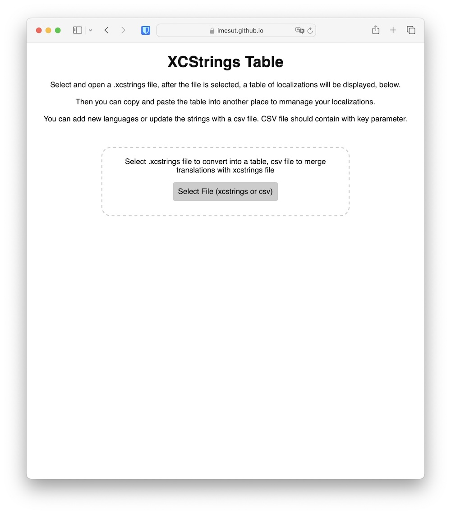
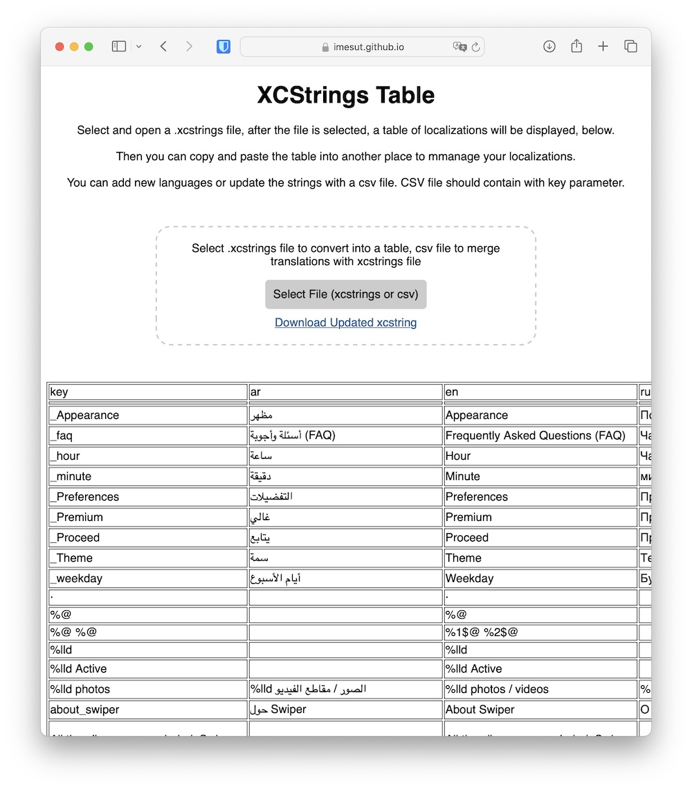

# Xcode String Catalog to Table

A web app to parse Xcode's new string catalog formatted .xcstrings files, as a table.

- Extract the keys as a table (so you can copy into your localiztion / translation tables)
- Upload new string values for existing locales / languages
- Add new languages with csv file.
- Export new catalog file easily.

The project is live at [Github page here.](https://imesut.github.io/xcstrings-to-table-webapp/)

## Note

Please upload csv file with headers, starting with `key` field.

